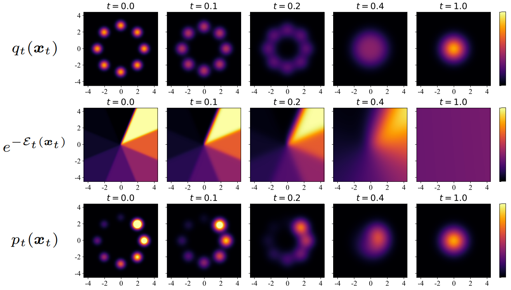

# Contrastive Energy Prediction
Official codebase for [Exact Energy-Guided Diffusion Sampling via Contrastive Energy Prediction with applications in offline RL](https://arxiv.org/abs/2304.12824).
Contains scripts to reproduce experiments.

Cheng Lu\*, Huayu Chen\*, Jianfei Chen†, Hang Su, Chongxuan Li, Jun Zhu†

\*equal contribution, †equal advising



## Instructions

We provide code in two sub-directories: `Offline_RL_2D` containing code for example toy 2D and offline RL experiments and `images` containing code (based on implementations of [openai/guided-diffusion](https://github.com/openai/guided-diffusion)) for Imagenet experiments.
See corresponding READMEs in each folder for instructions; scripts should be run from the respective directories.

## Citation

Please cite our paper as:

```
@article{lu2023contrastive,
  title={Contrastive Energy Prediction for Exact Energy-Guided Diffusion Sampling in Offline Reinforcement Learning},
  author={Lu, Cheng and Chen, Huayu and Chen, Jianfei and Su, Hang and Li, Chongxuan and Zhu, Jun},
  journal={arXiv preprint arXiv:2304.12824},
  year={2023}
}
```

## License

MIT
